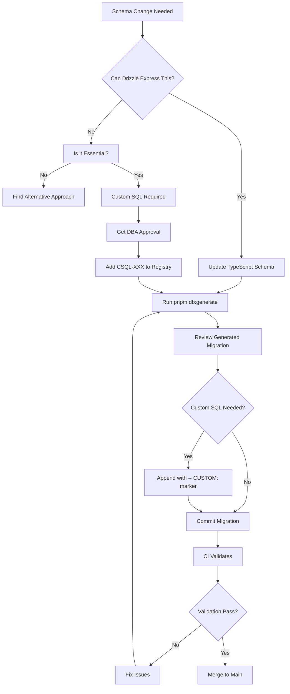

# Schema Lockdown Reference

## Overview

This document defines the complete schema management lockdown strategy for AFENDA. The goal is to make **Drizzle ORM the single source of truth** for schema management, while still allowing carefully documented custom SQL for advanced PostgreSQL features that cannot be expressed in Drizzle's formal schema language.

## Decision Matrix



## Validation Checks Reference

| Check | Script | When | Blocks Merge | Can Bypass |
|-------|--------|------|--------------|------------|
| Migration Format | `validate-migrations.ts` | Pre-commit, CI | Yes | Emergency only |
| Schema Drift | `detect-schema-drift.ts` | Pre-commit, CI, Daily | Yes | `--allow-drift` |
| Custom SQL Markers | `validate-migrations.ts` | CI | Yes | No |
| Custom SQL Registry | `validate-migrations.ts` | CI | Yes | No |
| Checksum Validation | `validate-migrations.ts` | CI | Yes | No |
| TypeScript Compilation | `tsc --noEmit` | Pre-commit, CI | Yes | No |
| Drizzle Check | `drizzle-kit check` | Pre-commit, CI | Yes | No |

## Custom SQL Approval Process

### Step 1: Determine Necessity

- Review [Decision Matrix](#decision-matrix)
- Check if Drizzle can express the feature
- Document why custom SQL is required

**Cannot be expressed in Drizzle (require custom SQL):**
- Table partitioning (PARTITION BY RANGE/LIST/HASH)
- Exclusion constraints (EXCLUDE USING)
- Triggers and trigger functions
- Stored procedures and functions
- Advanced indexes (GIN with jsonb_path_ops, partial indexes with complex expressions)
- Row-level security (RLS) policies
- Partition maintenance functions

**Can be expressed in Drizzle (should NOT use custom SQL):**
- Table definitions
- Column types and constraints
- Foreign keys
- Basic indexes
- Check constraints
- Unique constraints
- Enums

### Step 2: Get Approval

- Create GitHub issue with template (if available)
- Tag `@dba-team` and `@schema-owners`
- Include:
  - Purpose and justification
  - SQL snippet
  - Rollback procedure
  - Performance impact assessment

### Step 3: Add to Registry

- Assign next CSQL-XXX ID (check `CUSTOM_SQL_REGISTRY.json` for highest number)
- Add entry to `src/db/schema/audit/CUSTOM_SQL_REGISTRY.json`:
  ```json
  "CSQL-010": {
    "purpose": "Description of what this custom SQL does",
    "migration": "20260320120000_migration_name",
    "type": "TRIGGER|FUNCTION|PARTITION|INDEX|etc",
    "justification": "Why Drizzle can't express this",
    "rollback": "How to rollback this change",
    "approvedBy": "dba-team",
    "approvedDate": "2026-03-20",
    "sqlLines": "45-67"
  }
  ```
- Document in `src/db/schema/audit/CUSTOM_SQL.md` (optional, for detailed docs)

### Step 4: Implement

- Generate migration: `pnpm db:generate`
- Append custom SQL with marker at **end of file**:
  ```sql
  -- CUSTOM: Add audit trigger for employees table (CSQL-010)
  CREATE TRIGGER trg_employees_audit
    AFTER INSERT OR UPDATE OR DELETE ON hr.employees
    FOR EACH ROW
    EXECUTE FUNCTION audit.log_change_7w1h();
  ```
- Commit both migration and registry update

### Step 5: Validation

- Run `pnpm gate:early` locally
- CI validates all checks automatically
- Requires DBA approval in PR (via CODEOWNERS)

## Common Pitfalls

### ❌ Pitfall 1: Using `db:push` in Production

**Problem**: Bypasses migration history and audit trail

**Solution**: Always use `db:generate` + `db:migrate`

**Example**:
```bash
# ❌ Wrong
pnpm db:push

# ✅ Correct
pnpm db:generate
git add src/db/migrations
git commit -m "feat(db): add new column"
pnpm db:migrate
```

### ❌ Pitfall 2: Hand-Writing Migrations

**Problem**: Breaks checksum validation and snapshot alignment

**Solution**: Let Drizzle generate migrations, only append custom SQL

**Example**:
```sql
-- ❌ Wrong: Hand-written migration
CREATE TABLE core.new_table (
  id serial PRIMARY KEY,
  name text NOT NULL
);

-- ✅ Correct: Drizzle-generated + custom SQL
-- (Drizzle-generated SQL here)
--> statement-breakpoint
-- CUSTOM: Add audit trigger (CSQL-008)
CREATE TRIGGER trg_new_table_audit ...
```

### ❌ Pitfall 3: Unmarked Custom SQL

**Problem**: Fails CI validation

**Solution**: Always use `-- CUSTOM: <purpose> (CSQL-XXX)` marker

**Example**:
```sql
-- ❌ Wrong
CREATE FUNCTION audit.my_function() ...

-- ✅ Correct
-- CUSTOM: Add custom aggregation function (CSQL-009)
CREATE FUNCTION audit.my_function() ...
```

### ❌ Pitfall 4: Custom SQL in Wrong Location

**Problem**: Custom SQL should be at end of migration file

**Solution**: Always append custom SQL after all Drizzle-generated SQL

**Example**:
```sql
-- ✅ Correct order:
-- 1. Drizzle-generated SQL (CREATE TABLE, ALTER TABLE, etc.)
--> statement-breakpoint
-- 2. Custom SQL at the end
-- CUSTOM: Add trigger (CSQL-010)
CREATE TRIGGER ...
```

### ❌ Pitfall 5: Missing Registry Entry

**Problem**: CI validation fails if CSQL-XXX not in registry

**Solution**: Always add entry to `CUSTOM_SQL_REGISTRY.json` before committing

## Emergency Bypass Procedure

### When to Use

- Production outage requiring immediate schema change
- Critical security patch
- Data corruption requiring urgent fix

### Procedure

1. **Get Emergency Approval**
   - Contact on-call DBA
   - Get approval from Tech Lead
   - Document in incident log

2. **Apply Hotfix**
   ```bash
   # Option A: Direct SQL (if db:push won't work)
   psql $DATABASE_URL < hotfix.sql
   
   # Option B: Unsafe push (if schema change only)
   ALLOW_DB_PUSH=1 pnpm db:push:unsafe
   ```

3. **Create Follow-Up PR (within 24 hours)**
   - Reverse-engineer change into schema files
   - Generate proper migration
   - Add to CUSTOM_SQL_REGISTRY.json if needed
   - Add incident reference in PR description

4. **Post-Mortem**
   - Document why emergency bypass was needed
   - Identify process improvements
   - Update runbooks

### Audit Trail

All emergency bypasses are logged to:
- `docs/incidents/YYYY-MM-DD-emergency-bypass.md` (create if needed)
- GitHub issue with label `emergency-bypass`
- Slack/Teams #db-changes channel (if configured)

## Training Checklist

### For New Developers

- [ ] Read this document completely
- [ ] Review [DB-First Guideline](architecture/01-db-first-guideline.md)
- [ ] Practice workflow in test environment
- [ ] Make first schema change with mentor review
- [ ] Understand custom SQL approval process

### For Schema Changes

- [ ] Identify if Drizzle can express the change
- [ ] Get approval if custom SQL needed
- [ ] Update schema TypeScript files
- [ ] Run `pnpm db:generate`
- [ ] Review generated migration
- [ ] Add custom SQL with markers if needed
- [ ] Update CUSTOM_SQL_REGISTRY.json
- [ ] Run `pnpm gate:early` locally
- [ ] Commit and push
- [ ] Monitor CI validation
- [ ] Get DBA approval on PR

## FAQ

**Q: Can I use `db:push` for local development?**
A: Use `db:push:unsafe` with caution. It's better to practice the full workflow even locally.

**Q: What if I need to add a trigger?**
A: Triggers require custom SQL. Follow the [Custom SQL Approval Process](#custom-sql-approval-process).

**Q: How do I fix drift detected in CI?**
A: Run `pnpm db:generate` locally, review the migration, commit it.

**Q: Can I bypass validation for a quick fix?**
A: No. Even quick fixes must go through the workflow. Use [Emergency Bypass](#emergency-bypass-procedure) only for production outages.

**Q: What if my migration validation fails?**
A: Check the error message. Common issues:
- Missing `-- CUSTOM:` marker for custom SQL
- CSQL-XXX not in registry
- Custom SQL not at end of file
- Hand-written migration detected

**Q: How do I get the next CSQL-XXX ID?**
A: Check `src/db/schema/audit/CUSTOM_SQL_REGISTRY.json` and use the next sequential number.

## GitHub Branch Protection Rules

The following branch protection rules should be configured in GitHub:

- ✅ Require `db-ci` workflow to pass
- ✅ Require `early-gate` workflow to pass
- ✅ Require at least 1 approval for `src/db/schema/**` or `src/db/migrations/**`
- ✅ Require linear history (no force pushes to main)
- ✅ Require signed commits (optional, for audit trail)
- ✅ Dismiss stale reviews when new commits pushed

These rules are enforced via `.github/CODEOWNERS` file.

## Related Documentation

- [DB-First Guideline](architecture/01-db-first-guideline.md) - Complete schema design guidelines
- [Custom SQL Documentation](../src/db/schema/audit/CUSTOM_SQL.md) - Detailed custom SQL examples
- [CI Gate Implementation Audit](CI_GATE_IMPLEMENTATION_AUDIT.md) - CI validation details
