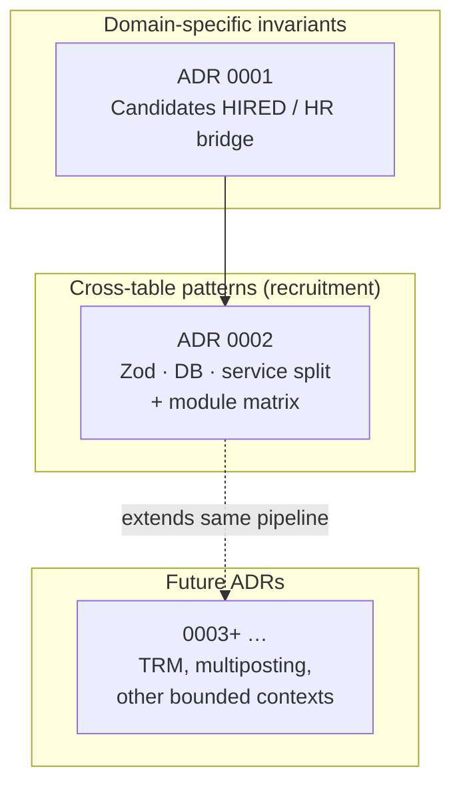

# Architecture Decision Records (ADR)

Short, durable decisions for **schema invariants**, **enforcement layering**, and **cross-cutting behavior**. They complement [01-db-first-guideline.md](../01-db-first-guideline.md) (how to migrate and ship SQL) by recording **what** we decided and **why**.

---

## Map: how enforcement ADRs fit together

| Layer                  | Role                                                                         | Documented in                                                                                                |
| ---------------------- | ---------------------------------------------------------------------------- | ------------------------------------------------------------------------------------------------------------ |
| **Domain row rules**   | One table or small cluster (e.g. hire semantics on `candidates`).            | **0001** and future **single-topic** ADRs                                                                    |
| **Pipeline / context** | How Zod, PostgreSQL, and services share work across many tables in one area. | **0002** (recruitment); **future:** duplicate pattern for another bounded context only if it diverges enough |

**ADR 0001** is **narrow**: one invariant on `recruitment.candidates` (HIRED ⇔ HR ids). **ADR 0002** is **broad**: the _pattern_ for recruitment downstream tables and pointers to tests; it **references 0001** for candidate-specific hire policy.

When you add **TRM**, **multiposting**, or another major area:

- **Extends recruitment with the same philosophy** (Zod + CHECK + optional service tenant guard) → update **0002**’s module table + JSDoc/databank; no new ADR unless policy changes materially.
- **New invariant that is product-defining** (e.g. “multiposting must never duplicate live postings per channel”) → new **0003** (or next free number): Context / Decision / Consequences / Rollback / Verification, and add a row below.

---

## Index

| ADR                                                 | Scope                                                                       | Title                                                                       |
| --------------------------------------------------- | --------------------------------------------------------------------------- | --------------------------------------------------------------------------- |
| [0001](./0001-candidate-hired-hr-bridge.md)         | `recruitment.candidates`                                                    | Candidate `HIRED` requires `personId` + `convertedEmployeeId` (CHECK + Zod) |
| [0002](./0002-recruitment-lifecycle-enforcement.md) | Recruitment pipeline (applications → offers, checks, exit interviews, etc.) | Lifecycle enforcement: Zod vs PostgreSQL vs service helpers                 |

---

## Adding a new ADR

1. **Pick the next number** (`0003`, …) and filename `NNNN-short-kebab-title.md`.
2. **Copy sections** from [0001](./0001-candidate-hired-hr-bridge.md): **Context**, **Decision**, **Consequences**, **Rollback** (and optional **Verification** / **Related**).
3. **Link peers**: if recruitment-only, reference **0002**; if it tightens **candidates**, reference **0001**.
4. **Register** this README: add a row to **Index** and, if needed, one line in the **Map** (new box or “extends 0002”).
5. **Wire discoverability**: link from the relevant doc under `docs/` (e.g. databank, domain primer) and from affected `src/db/schema-platform/**` JSDoc where helpful.

Do **not** use ADRs for routine migration notes; those stay in migration folders and the db-first guideline.

**Audit matrix guardrails:** Adding or removing `recruitment.*` / `talent.*` tables requires updating `docs/hr-schema-audit-matrix.md` and `scripts/lib/hr-schema-audit-matrix-core.ts` (`REQUIRED_RECRUITMENT_TABLES` / `REQUIRED_TALENT_TABLES`, `EXPECTED_TABLE_ROWS`). CI: `pnpm check:hr-audit-matrix` and `hr-schema-audit-matrix.test.ts`.

---

## Related

- [Recruitment candidate databank](../../recruitment-candidate-databank.md) — links **0001** and **0002** in scope.
- [DB-first guideline](../01-db-first-guideline.md) — migrations, CSQL, drift.
