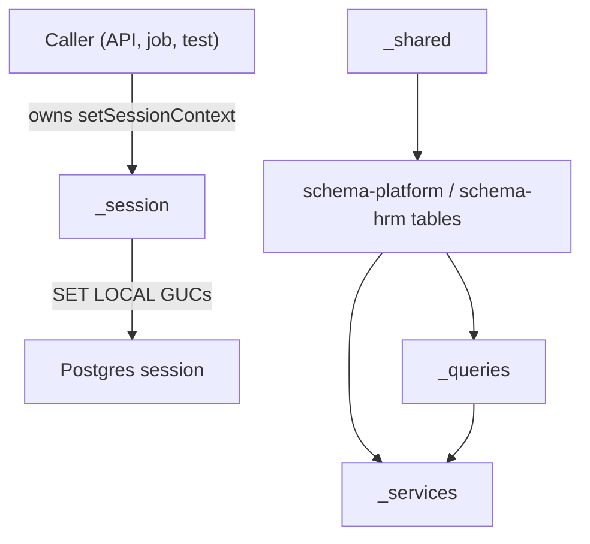

# AFENDA Database Layer

This directory contains the database schema definitions, migrations, and related infrastructure for AFENDA.

## Quick Start

```bash
# Install dependencies
pnpm install

# Set up environment
cp .env.example .env
# Edit .env with your DATABASE_URL

# For testing: Start Docker test database
pnpm docker:test:start

# Run migrations
pnpm db:migrate

# Run tests
pnpm test:db

# Open Drizzle Studio (visual DB browser)
pnpm db:studio
```

## Directory Structure

### Infrastructure folders (quick nav)

| Path             | Role                                                              | README                                        |
| ---------------- | ----------------------------------------------------------------- | --------------------------------------------- |
| **`_shared/`**   | Common column mixins, Zod wire, CI fingerprints                   | [\_shared/README.md](./_shared/README.md)     |
| **`_session/`**  | Session context API (`setSessionContext` / `clearSessionContext`) | [\_session/README.md](./_session/README.md)   |
| **`_queries/`**  | Multi-table query helpers and domain barrels                      | [\_queries/README.md](./_queries/README.md)   |
| **`_services/`** | Service layer (e.g. recruitment tenant guards)                    | [\_services/README.md](./_services/README.md) |

### Schema packages (quick nav)

| Path                   | Role                                                                       | README                                                   |
| ---------------------- | -------------------------------------------------------------------------- | -------------------------------------------------------- |
| **`schema-platform/`** | `core`, `security`, `audit`; **Drizzle Kit** schema entry + re-exports HRM | [schema-platform/README.md](./schema-platform/README.md) |
| **`schema-hrm/`**      | `hr`, `payroll`, `benefits`, `learning`, `recruitment`, `talent`           | [schema-hrm/README.md](./schema-hrm/README.md)           |

```
src/db/
├── _shared/              # Column mixins + `zodWire.ts` — see [_shared/README.md](./_shared/README.md)
├── schema-platform/      # core, security, audit — [schema-platform/README.md](./schema-platform/README.md); `index.ts` = Drizzle Kit entry + re-exports **schema-hrm**
│   ├── core/             # Tier 1: tenants, orgs, locations, …
│   ├── security/         # Tier 2: users, roles, …
│   ├── audit/            # Tier 2: audit trail
│   └── index.ts          # Drizzle Kit entry + re-exports schema-hrm domains
├── schema-hrm/           # Human capital domains — [schema-hrm/README.md](./schema-hrm/README.md)
│   ├── hr/
│   ├── payroll/
│   ├── benefits/
│   ├── learning/
│   ├── recruitment/
│   └── talent/
├── _session/             # Postgres session GUCs — [_session/README.md](./_session/README.md)
├── _queries/             # Multi-table data-access helpers — [_queries/README.md](./_queries/README.md)
├── _services/            # Use-case DB services (tenant guards, etc.) — [_services/README.md](./_services/README.md)
├── migrations/           # Generated SQL migrations
├── __tests__/            # Database tests
│   ├── smoke.test.ts     # Smoke tests
│   └── contracts.test.ts # Contract tests
├── db.ts                 # Database connection
└── README.md
```

### Layer boundaries (naming & location)

| Location                          | What belongs here                                                                                              | Must not                                                                       |
| --------------------------------- | -------------------------------------------------------------------------------------------------------------- | ------------------------------------------------------------------------------ |
| **`src/db/_shared`**              | Global **schema primitives**: Drizzle column mixins, `zodWire.ts`. No `Database`, no business rules.           | Import `_services/` or `_queries/`; define tables.                             |
| **`schema-hrm/<domain>/_shared`** | **Domain-only** helpers (e.g. `talent/_shared/proficiency.ts`) co-located with that PG schema.                 | Re-export as if it were global `_shared`.                                      |
| **`src/db/_session`**             | Connection/session **infrastructure** (`setSessionContext`, `DbExecutor`).                                     | Domain queries or table definitions.                                           |
| **`src/db/_queries/<domain>`**    | **Data-access helpers**: async functions taking `Database` + tenant args, composing multiple tables.           | Replace Drizzle table modules; grow without bound — split by domain subfolder. |
| **`src/db/_services/<area>`**     | **Application services**: orchestration, validation, errors for API/use-cases; may call `_queries/*` and `db`. | Put table definitions only in `schema-*`; keep services out of `_shared`.      |

**Imports:** Within a leaf folder (`_queries/<domain>/`, `_services/<area>/`, `_shared/`) use **relative** imports between sibling files. When crossing areas of `src/db` (e.g. `_services` → `schema-hrm`, `__tests__` → `_services`), use the **`@db/*`** alias (`@db/db`, `@db/schema-hrm/...`, `@db/_services/recruitment`, `@db/_queries/talent`). Root barrels (`_queries/index.ts`, `_services/index.ts`, `_shared/index.ts`) use **explicit** named re-exports — no `export *`. `_session` is a single implementation file plus `index.ts` with explicit exports. Integration tests should import services via `@db/_services/recruitment` (or `@db/_services` for the full recruitment surface) — keep intent explicit in test names.

### Infrastructure READMEs (boundaries & integration)

| Layer            | Purpose                                                  | Integration                                                                                                                                                  |
| ---------------- | -------------------------------------------------------- | ------------------------------------------------------------------------------------------------------------------------------------------------------------ |
| **`_shared/`**   | Column mixins, Zod wire, CI fingerprints                 | Consumed when authoring **`schema-*`** table modules (primary). `_queries` / `_services` typically use **tables and generated Zod**, not `_shared` directly. |
| **`_queries/`**  | Multi-table query helpers (`Database` + composition)     | Imports **`schema-*`**; may be called from **`_services`**.                                                                                                  |
| **`_services/`** | Use-case DB APIs (guards, `schema.parse`, stable errors) | Imports **`schema-*`**; may call **`_queries`**.                                                                                                             |
| **`_session/`**  | Session context API (`set` / `clear`)                    | **Owned by callers** (API middleware, jobs, tests): invoke **`setSessionContext`** before DB work that must attribute tenant/user to audit triggers or RLS.  |



#### Session GUC namespace (canonical)

Postgres custom settings are written by [`setSessionContext`](./_session/setSessionContext.ts) under the **`afenda.*`** prefix so triggers and policies can read a stable name (e.g. `current_setting('afenda.tenant_id', true)`). Current keys include: `afenda.tenant_id`, `afenda.user_id`, `afenda.actor_type`, `afenda.correlation_id`, `afenda.request_id`, `afenda.session_id`, `afenda.ip_address`, `afenda.user_agent`.

Renaming the prefix (for example to `app.*`) is **not** a TypeScript-only change: it requires migrations and every SQL consumer of `afenda.*` to move together. Treat **`afenda.*`** as the cross-domain standard unless an ADR replaces it.

## Commands

| Command                   | Description                                                |
| ------------------------- | ---------------------------------------------------------- |
| `pnpm db:generate`        | Generate migration from schema changes                     |
| `pnpm db:migrate`         | Apply pending migrations                                   |
| `pnpm db:push`            | ❌ **Disabled** - Use `db:generate` + `db:migrate` instead |
| `pnpm db:push:unsafe`     | ⚠️ **Unsafe** - Bypasses schema lockdown (local dev only)  |
| `pnpm db:check`           | Verify migration consistency                               |
| `pnpm db:drift-check`     | Check for schema drift (uncommitted schema changes)        |
| `pnpm check:migrations`   | Validate migration format and custom SQL markers           |
| `pnpm check:drift`        | Detect schema changes without migrations                   |
| `pnpm db:pull`            | Introspect existing DB into schema                         |
| `pnpm db:studio`          | Open Drizzle Studio                                        |
| `pnpm db:verify-exports`  | Verify Zod schema exports                                  |
| `pnpm test:db`            | Run all database tests                                     |
| `pnpm test:db:smoke`      | Run smoke tests only                                       |
| `pnpm test:db:contracts`  | Run contract tests only                                    |
| `pnpm docker:test:start`  | Start Docker test database                                 |
| `pnpm docker:test:stop`   | Stop Docker test database                                  |
| `pnpm docker:test:reset`  | Reset test database (clear data)                           |
| `pnpm docker:test:status` | Check test database status                                 |

## Schema Lockdown

AFENDA enforces strict schema management to prevent drift and ensure consistency:

### Rules

1. ✅ All schema changes via Drizzle TypeScript definitions
2. ✅ All migrations generated by `drizzle-kit generate`
3. ❌ No `db:push` (use `db:generate` + `db:migrate`)
4. ❌ No hand-written migrations
5. ⚠️ Custom SQL allowed ONLY for features Drizzle can't express (see [SCHEMA_LOCKDOWN.md](../../docs/SCHEMA_LOCKDOWN.md))

### Workflow

1. **Make schema changes** in TypeScript files (`src/db/schema-platform/**/*.ts`, `src/db/schema-hrm/**/*.ts`)
2. **Generate migration**: `pnpm db:generate`
3. **Review generated SQL** in `src/db/migrations/`
4. **Add custom SQL if needed** (at end of file):
   ```sql
   -- CUSTOM: Add audit trigger for employees table (CSQL-XXX)
   CREATE TRIGGER trg_employees_audit ...
   ```
5. **Update registry**: Add entry to `CUSTOM_SQL_REGISTRY.json` with CSQL-XXX ID
6. **Run local checks**: `pnpm gate:early`
7. **Commit both** schema and migration files
8. **CI validates** everything automatically

### Validation

Run `pnpm gate:early` before committing to catch issues locally:

- Schema drift detection
- Migration format validation
- Custom SQL marker verification
- TypeScript compilation
- Zod schema exports

See [docs/SCHEMA_LOCKDOWN.md](../../docs/SCHEMA_LOCKDOWN.md) for complete documentation.

### Core Schema Quality Standards

All core schema tables follow these standards:

- ✅ Exported const arrays for enum values (runtime validation)
- ✅ Case-insensitive partial unique indexes on code columns
- ✅ Explicit FK actions (`onDelete: 'restrict'`, `onUpdate: 'cascade'`)
- ✅ Branded ID types for type safety
- ✅ Complete Zod schemas (select, insert, update)
- ✅ TypeScript type exports
- ✅ Consistent import organization

**Zod import with `drizzle-orm/zod`:** use `import { z } from "zod/v4"` in schema modules (not `"zod"`). Drizzle’s Zod helpers are typed against the `zod/v4` entry point; mixing `"zod"` refinements with `createInsertSchema` / `createSelectSchema` / `createUpdateSchema` triggers TS2322 in the IDE.

See `.cursor/CORE_SCHEMA_SYNC_REPORT.md` for detailed quality report.

### Adding a New Table

1. Create the table file under `src/db/schema-platform/...` or `src/db/schema-hrm/<domain>/...`
2. Include required mixins; define **`tenantId`** explicitly with `foreignKey()` to `core.tenants` when the table is tenant-scoped (do not invent a `tenantScopedColumns` mixin):
   ```typescript
   import { timestampColumns, softDeleteColumns } from "@db/_shared";
   ```
3. Export Zod schemas:
   ```typescript
   export const myTableSelectSchema = createSelectSchema(myTable);
   export const myTableInsertSchema = createInsertSchema(myTable);
   ```
4. Add to the schema's `index.ts` barrel export
5. Add relations in `_relations.ts` if needed

## CI Gate

All PRs touching `src/db/` must pass:

- **Schema Check**: `drizzle-kit check` passes
- **Migration Test**: Migrations apply cleanly up/down/up
- **Smoke Tests**: Basic CRUD operations work
- **Contract Tests**: Schema structure matches expectations
- **Type Safety**: TypeScript compiles, Zod exports exist
- **Security Scan**: No secrets or dangerous operations

See `.github/workflows/db-ci.yml` for details.

## Testing with Docker

For integration tests, use the Docker test database:

```bash
# Start test database
pnpm docker:test:start

# Run tests (migrations auto-applied)
pnpm test:db

# Stop when done
pnpm docker:test:stop
```

The test database:

- Runs on port **5433** (to avoid conflicts)
- Auto-installs required extensions (`btree_gist`, `pgcrypto`)
- Automatically applies migrations before tests run
- Persists data between test runs (use `pnpm docker:test:reset` to clear)

See [docs/testing/DOCKER_TEST_SETUP.md](../../docs/testing/DOCKER_TEST_SETUP.md) for detailed documentation.

## Continuing HCM / ERP database work

Schema work is **domain-driven** under [`schema-platform`](./schema-platform/README.md) and [`schema-hrm`](./schema-hrm/README.md). After product prioritization:

1. **Change Drizzle modules** in the right package (platform vs HRM domain folder).
2. **`pnpm db:generate`** → review SQL → **`pnpm db:migrate`** on dev/test DB.
3. Register **custom SQL** in [`schema-platform/audit/CUSTOM_SQL_REGISTRY.json`](./schema-platform/audit/CUSTOM_SQL_REGISTRY.json) when triggers/CHECKs are required.
4. Run **`pnpm gate:early`** and **`pnpm test:db`** (or contracts subset) before pushing.

**Planning / inventory**

- [Talent management roadmap](../../docs/talent-management-roadmap.md) — future TM capabilities (calibration, 360, IDP, nine-box, …).
- [Talent schema inventory](../../docs/talent-schema-inventory.md) — checklist for `talent` tables + CSQL links.
- [HR schema audit matrix](../../docs/hr-schema-audit-matrix.md) — cross-domain coverage expectations.

## Documentation index

- **[docs/README.md](../../docs/README.md)** — map of maintained docs (schema lockdown, CI gates, quick start)
- **`src/db` infrastructure READMEs**
  - [`src/db/_shared/README.md`](./_shared/README.md)
  - [`src/db/_session/README.md`](./_session/README.md)
  - [`src/db/_queries/README.md`](./_queries/README.md)
  - [`src/db/_services/README.md`](./_services/README.md)
- **Schema packages**
  - [`src/db/schema-platform/README.md`](./schema-platform/README.md)
  - [`src/db/schema-hrm/README.md`](./schema-hrm/README.md)

## Guidelines

Full documentation: [docs/architecture/01-db-first-guideline.md](../../docs/architecture/01-db-first-guideline.md)

Key rules:

- Every column is `.notNull()` unless justified
- Tenant-scoped tables must include `tenantId` via mixin
- Use `foreignKey()` for cross-schema references
- Index `tenantId` as leading column
- Export Zod schemas alongside table definitions (`z` from `zod/v4` when using `drizzle-orm/zod`; see note under Core Schema Quality Standards)
