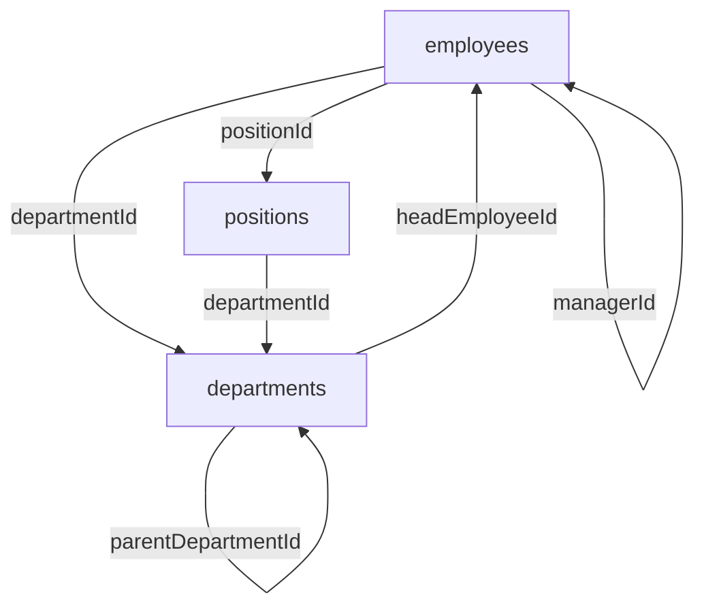

# HR Schema: Circular Foreign Key Handling

## Overview

The HR schema has circular foreign key dependencies that cannot be expressed directly in Drizzle schema files due to TypeScript circular import restrictions:



## Solution: Custom SQL in Migrations

Per the DB-first guideline (Section 4.13 and 8.2.1), circular FKs are added via **custom SQL** appended to the generated migration file.

### Step 1: Generate Base Migration

Run `pnpm db:generate` to create the migration with all tables and non-circular FKs.

### Step 2: Append Custom SQL

Add the following to the end of the generated migration file:

```sql
-- CUSTOM: Add circular foreign keys for HR schema (CSQL-XXX)

-- employees.departmentId -> departments.departmentId
ALTER TABLE "hr"."employees" 
  ADD CONSTRAINT "fk_employees_department" 
  FOREIGN KEY ("departmentId") 
  REFERENCES "hr"."departments"("departmentId") 
  ON DELETE RESTRICT 
  ON UPDATE CASCADE;

-- employees.positionId -> positions.positionId
ALTER TABLE "hr"."employees" 
  ADD CONSTRAINT "fk_employees_position" 
  FOREIGN KEY ("positionId") 
  REFERENCES "hr"."positions"("positionId") 
  ON DELETE RESTRICT 
  ON UPDATE CASCADE;

-- departments.headEmployeeId -> employees.employeeId
ALTER TABLE "hr"."departments" 
  ADD CONSTRAINT "fk_departments_head_employee" 
  FOREIGN KEY ("headEmployeeId") 
  REFERENCES "hr"."employees"("employeeId") 
  ON DELETE RESTRICT 
  ON UPDATE CASCADE;

-- positions.departmentId -> departments.departmentId
ALTER TABLE "hr"."positions" 
  ADD CONSTRAINT "fk_positions_department" 
  FOREIGN KEY ("departmentId") 
  REFERENCES "hr"."departments"("departmentId") 
  ON DELETE RESTRICT 
  ON UPDATE CASCADE;
```

### Step 3: Register in Custom SQL Registry

Add entry to `src/db/schema/audit/CUSTOM_SQL_REGISTRY.json`:

```json
"CSQL-XXX": {
  "purpose": "Add circular foreign keys for HR schema (employees ↔ departments ↔ positions)",
  "migration": "20260320XXXXXX_add_hr_schema",
  "type": "FOREIGN_KEY",
  "justification": "Drizzle cannot express circular FKs due to TypeScript circular import restrictions",
  "rollback": "DROP CONSTRAINT statements in reverse order",
  "approvedBy": "dba-team",
  "approvedDate": "2026-03-20",
  "sqlLines": "XXX-XXX"
}
```

## Relations Definition

All relations (including circular ones) are defined in `hr/_relations.ts` using Drizzle's `defineRelations()` API. This enables:

- `db.query.employees.findMany({ with: { department: true, position: true, manager: true } })`
- `db.query.departments.findMany({ with: { headEmployee: true, parent: true, children: true } })`
- Type-safe query building with full relation traversal

Relations are **application-level only** and do not create database constraints. The custom SQL FKs provide database-level referential integrity.

## Why This Approach?

1. **TypeScript Limitation**: Cannot have circular imports in ES modules
2. **Drizzle Limitation**: Table definitions must import referenced tables for FK syntax
3. **Guideline Compliance**: Custom SQL is explicitly allowed for features Drizzle cannot express (Section 8.2.1)
4. **Best Practice**: Relations for queries + FKs for integrity (guideline Section 4.7)

## Alternative Approaches (Not Used)

### Option A: Deferred Constraints
Use `DEFERRABLE INITIALLY DEFERRED` on circular FKs. Rejected because:
- Adds transaction complexity
- Not supported in Drizzle schema syntax
- Still requires custom SQL

### Option B: Remove Circular FKs
Only enforce via relations, not DB constraints. Rejected because:
- Violates guideline P3: "Enforce Invariants in the DB"
- Loses referential integrity guarantees
- Application bugs could corrupt data

### Option C: Nullable + Triggers
Make circular FK columns nullable, use triggers to enforce. Rejected because:
- Complicates data model (false nullability)
- Trigger complexity
- Harder to reason about

## References

- [DB-First Guideline Section 4.13](../../docs/architecture/01-db-first-guideline.md#413--custom-sql-escapes)
- [DB-First Guideline Section 8.2.1](../../docs/architecture/01-db-first-guideline.md#821--custom-sql-rules)
- [Drizzle Relations Docs](https://orm.drizzle.team/docs/rqb#declaring-relations)
