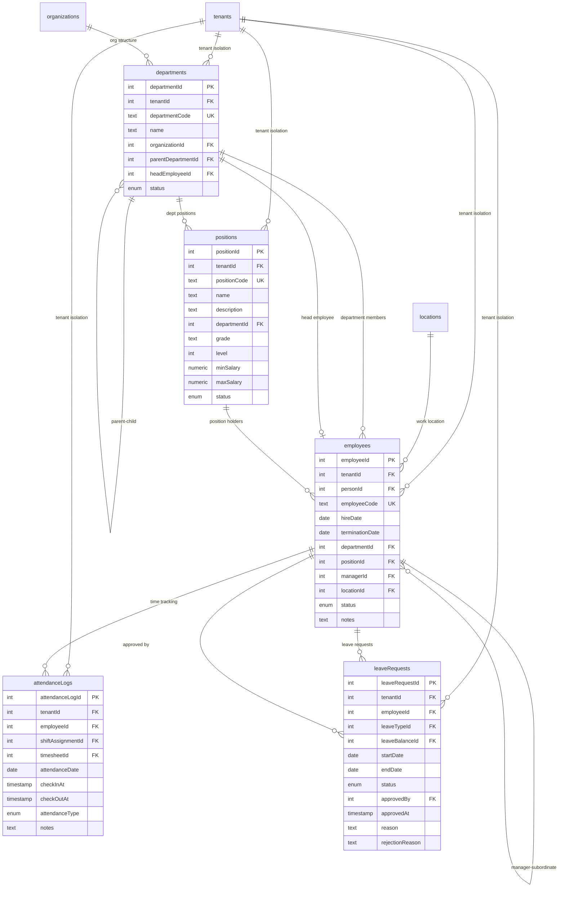
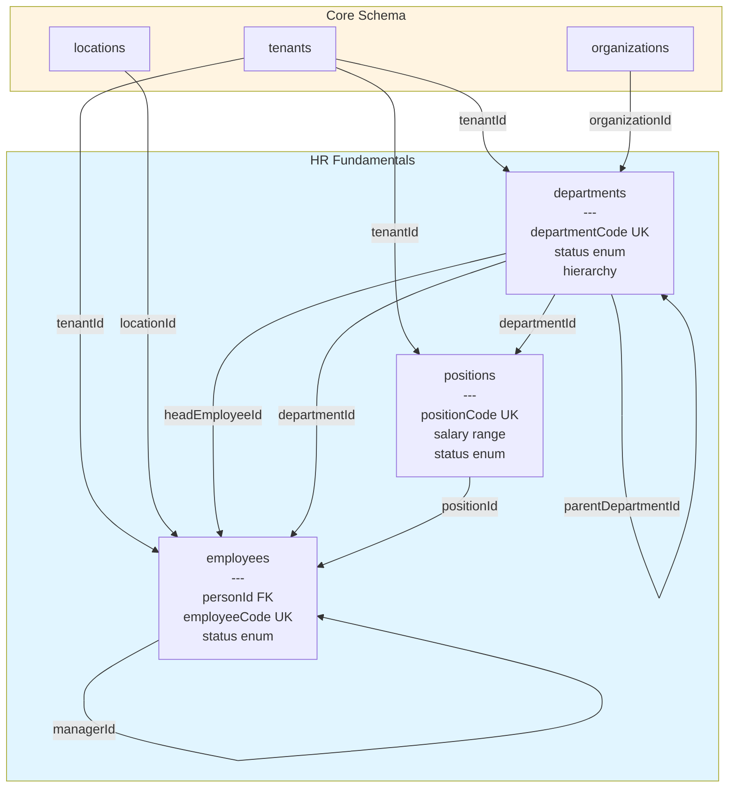
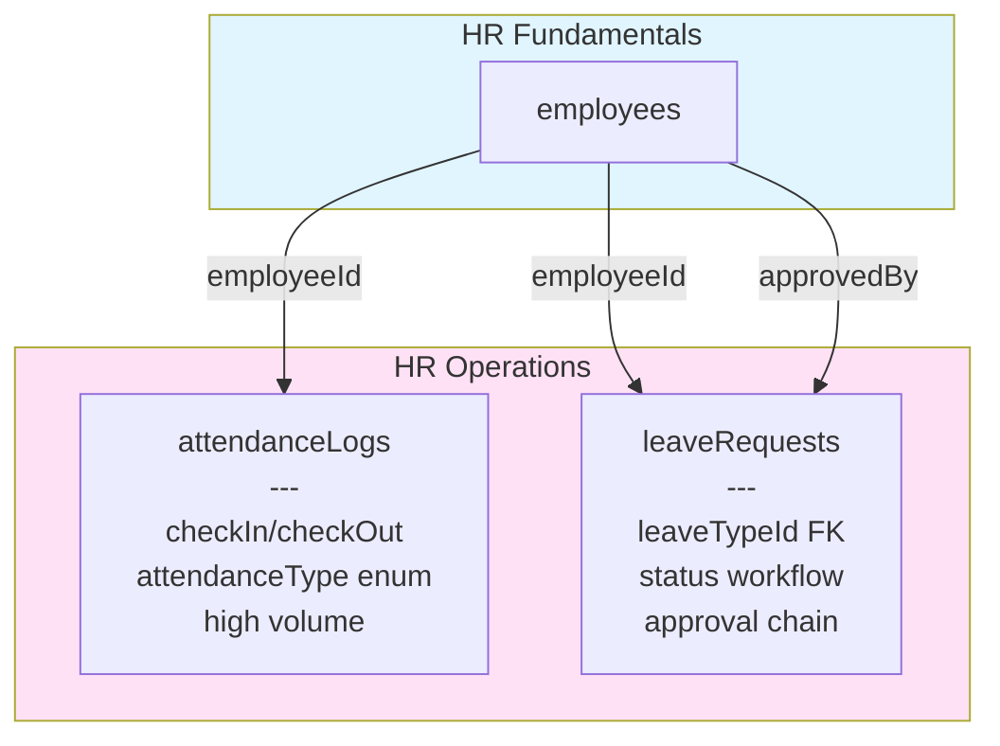

# HR Schema Entity Relationship Diagram

## Complete Schema Overview



> Payroll batches live in **`payroll.payroll_runs`**, not in `hr`.

## Fundamentals Layer

Master data with structural invariants:



## Operations Layer

Transactional data with high write volume:



## Enums

### Employee Status
- `ACTIVE` - Currently employed
- `ON_LEAVE` - Temporarily absent
- `TERMINATED` - Employment ended
- `SUSPENDED` - Temporarily suspended
- `PENDING` - Onboarding in progress

### Department Status
- `ACTIVE` - Operating department
- `INACTIVE` - Temporarily inactive
- `ARCHIVED` - Historical record

### Position Status
- `ACTIVE` - Open for assignment
- `INACTIVE` - Temporarily closed
- `ARCHIVED` - Historical record

### Attendance Type
- `REGULAR` - Standard work hours
- `OVERTIME` - Extended hours
- `REMOTE` - Work from home
- `ON_SITE` - Office/facility work
- `FIELD_WORK` - External location
- `TRAINING` - Training/development

### Leave Type
- `ANNUAL` - Vacation/PTO
- `SICK` - Medical leave
- `MATERNITY` - Maternity leave
- `PATERNITY` - Paternity leave
- `UNPAID` - Unpaid leave
- `COMPASSIONATE` - Bereavement/family emergency
- `STUDY` - Educational leave
- `SABBATICAL` - Extended break

### Leave Request Status
- `PENDING` - Awaiting approval
- `APPROVED` - Approved by manager
- `REJECTED` - Denied by manager
- `CANCELLED` - Cancelled by system/admin
- `WITHDRAWN` - Withdrawn by employee

### Payroll Run Status
- `DRAFT` - Being prepared
- `PROCESSING` - Calculation in progress
- `COMPLETED` - Successfully processed
- `FAILED` - Processing error
- `CANCELLED` - Cancelled before completion

## Data Flow Examples

### Employee Onboarding
1. Create `employee` record (status: PENDING)
2. Assign `departmentId`, `positionId`, `managerId`
3. Link `locationId` for work location
4. Update status to ACTIVE

### Leave Request Workflow
1. Employee creates `leaveRequest` (status: PENDING)
2. Manager reviews and updates `approvedBy`, `approvedAt`, status → APPROVED
3. Or manager rejects with `rejectionReason`, status → REJECTED
4. System tracks via `attendanceLogs` during leave period

### Payroll Processing
1. Create `payrollRun` (status: DRAFT)
2. Calculate amounts, update `totalAmount`
3. Update status → PROCESSING
4. Complete processing: set `processedBy`, `completedAt`, status → COMPLETED
5. On error: status → FAILED with notes

## Query Examples

### Find all employees in a department with their positions
```typescript
const deptEmployees = await db.query.employees.findMany({
  where: eq(employees.departmentId, deptId),
  with: {
    position: true,
    manager: true,
    location: true,
  },
});
```

### Get department hierarchy with head employees
```typescript
const deptTree = await db.query.departments.findMany({
  where: eq(departments.tenantId, tenantId),
  with: {
    parent: true,
    children: true,
    headEmployee: true,
    organization: true,
  },
});
```

### Find pending leave requests for approval
```typescript
const pendingLeaves = await db.query.leaveRequests.findMany({
  where: and(
    eq(leaveRequests.tenantId, tenantId),
    eq(leaveRequests.status, 'PENDING')
  ),
  with: {
    employee: {
      with: {
        department: true,
        position: true,
      },
    },
  },
  orderBy: [asc(leaveRequests.startDate)],
});
```

### Get attendance summary for an employee
```typescript
const attendance = await db.query.attendanceLogs.findMany({
  where: and(
    eq(attendanceLogs.employeeId, employeeId),
    gte(attendanceLogs.attendanceDate, startDate),
    lte(attendanceLogs.attendanceDate, endDate)
  ),
  orderBy: [desc(attendanceLogs.attendanceDate)],
});
```

## Compliance

✅ **DB-First Guideline**: 100% compliant with all patterns  
✅ **DRY**: No duplicate relation definitions  
✅ **Consistency**: Matches core/security/audit patterns  
✅ **Type Safety**: Branded IDs, Zod 4 schemas, full type inference  
✅ **Integrity**: Foreign keys, check constraints, unique constraints  
✅ **Performance**: Strategic indexes on all query paths  
✅ **Tenancy**: Explicit tenant isolation on all tables  

## References

- [DB-First Guideline](../../../docs/architecture/01-db-first-guideline.md)
- [Circular FK Documentation](./CIRCULAR_FKS.md)
- [Shared Column Mixins](../_shared/README.md)
